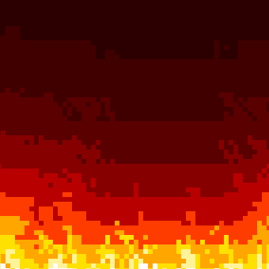
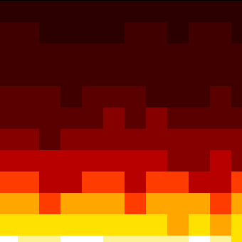
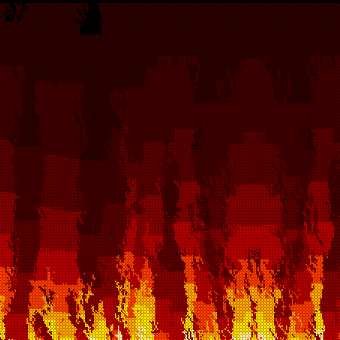

[](https://dacre-denny.github.io/retro-fire-css/assets/heading.html)

## Summary

Inspired from games of the 80's and 90's, RetroFireCSS applies a dynamically generated retro fire effect to the background of page elements

### Demos

[Heading showcase](https://dacre-denny.github.io/retro-fire-css/assets/heading.html)

[Feature showcase](https://dacre-denny.github.io/retro-fire-css/assets/feaures.html)

## Quick Start

```html
<!-- Import the RetroFireCSS painter -->
<script src="/src/lib.js"></script>

<!-- Apply RetroFireCSS painter -->
<h1 style="background: paint(retro-fire);">I'm on fire</h1>
```

## Features

- Fire is dynamically rendered each time element is redrawn
- Adaptive to dimensions of element
- Accepts simulation parameters;
  - `--fire-ambient`
  - `--fire-turbulence`
  - `--fire-scatter`
- Accepts rendering parameters;
  - `--fire-scale`

## API

The following (optional) CSS variables provide per element control over rendering and simulation behavior:

```css
.retro-fire-background {
  /* Rendering pixelation [1-100] */
  --fire-scale: 4;

  /* Randomize fuel distribution [0.0-1.0] */
  --fire-scatter: 0.25;

  /* Scale randomized heat diffusion [0.0-1.0] */
  --fire-turbulence: 0.25;

  /* Ambient heat [0.0-1.0] */
  --fire-ambient: 0.125;

  /* Apply retro fire worklet */
  background: paint(retro-fire);
}
```

## Examples

<div>



</div>
<br/>

## Notes

A few of the things I learnt from this experiment:

### Animation is not possible from Paint Worklet context

My original goal was to achieve an animated fire effect [similar to this](https://dacre-denny.github.io/retro-fire-css/assets/animated.html), via the PaintAPI. I discovered animation wasn't going to be possible due to `requestAnimationFrame`, `setTimeout` and `setInterval` not being available in the context of a Paint Worklet.

### Paint Worklet's context is a subset of CanvasRenderingContext2D

The [`putImageData()`](https://developer.mozilla.org/en-US/docs/Web/API/CanvasRenderingContext2D/putImageData) method is not available on the `context` interface passed to the [Paint Worklet's `paint()`](https://developer.mozilla.org/en-US/docs/Web/API/PaintWorklet#create_a_paintworklet) method ([according to MDN](https://developer.mozilla.org/en-US/docs/Web/API/CSS_Painting_API#interfaces), the `context` passed to a Paint Worklet's `paint` method implements a subset of `CanvasRenderingContext2D`, as `PaintRenderingContext2D`). I therefore had to paint each pixel of the fire simulation one at a time, rather than via a single call to `putImageData()`.
